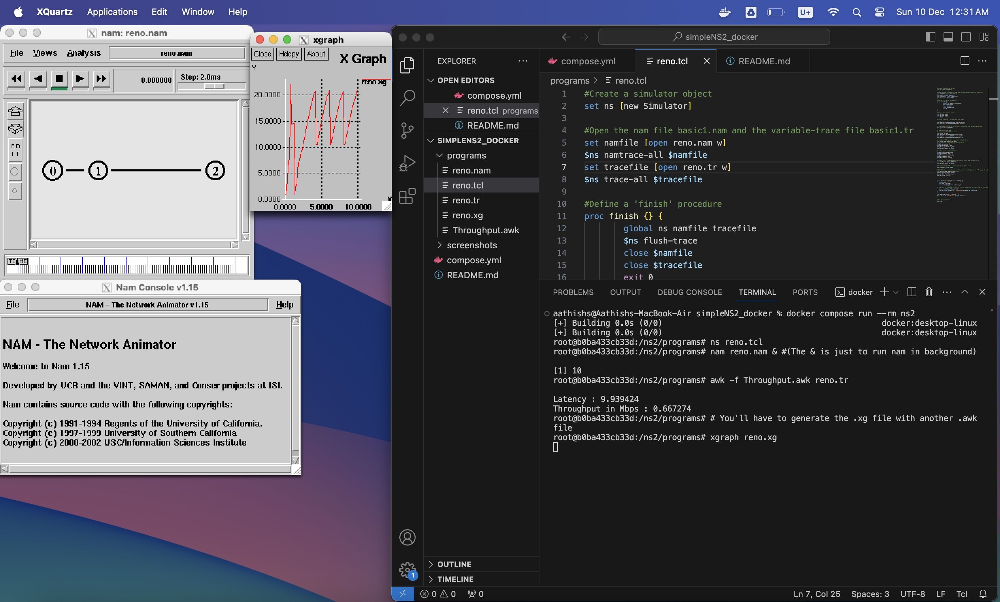

# aathish04/simpleNS2_docker

This repository provides a small docker `compose.yml` file to easily run NS2 TCL simulations using the `ekiourk/ns2:latest` docker image.

# Prerequisites for Use
1) You have Docker Desktop installed.
2) You have a running X Window Server (such as XQuartz) running on your host, and it is configured to accept connections from localhost.

## Getting Started
1) Clone this repository to your local system.
2) Move into this directory.
3) Place your `.tcl` programs inside the `programs` folder. This folder will be `bind-mount`ed into the docker container for ns2 as the `/ns2/programs` folder.
4) Run `docker compose run --rm ns2`
    
    The `--rm` is important. Without it, docker will create a new container each time you run the command and ultimately take up way too much hard-drive space.

    You will be dropped into a root `bash` shell where the current working directory is `/ns2/programs`. You should be able to see all the programs that you placed in the `programs` folder on the host machine here.
    
    In the root shell you were dropped into you can run the `ns`, `nam` and `xgraph` commands (and essentially any command provided by the `ns-allinone-2.35` software).
    
    Run a command that invokes a GUI application (like `xgraph` on a `.xgr` file or `nam` on a `.nam` file) and you should see the appropriate window pop up on your desktop.
    
    

5) Once you're done with `NS2` (say, at the end of your semester) you can delete any container created for NS2 (if you ever left out the `--rm` in the `docker compose run` command) and the `ekiourk/ns2 Docker Image` through the Docker Desktop dashboard.

## Contribution

Is welcome. Issues and bug reports, as well as pull requests are highly encouraged.